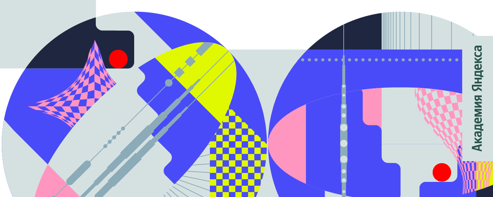
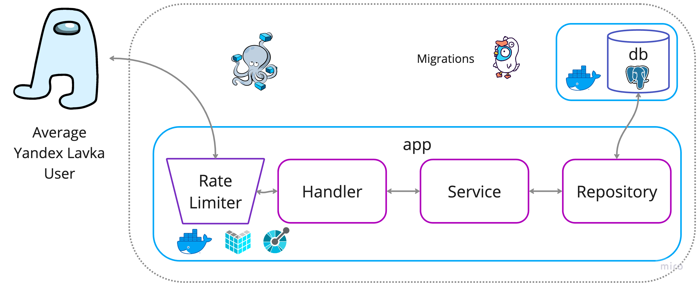

# Школа бэкенд-разработки направление «Go»

## Содержание
- [Контест](contest/README.md)
- [Продуктовая задача](product/README.md)

## Архитектура Продуктовой задачи

## Используемые зависимости и тулы
- [echo](https://github.com/labstack/echo) high performance, minimalist Go web framework. Task included by default 
- [oapi-codege](https://github.com/deepmap/oapi-codegen) Client and Server Code Generator from the oapi.json
- [sqlx](https://github.com/jmoiron/sqlx) extension on go's standard database/sql
- [pgx](https://github.com/jackc/pgx) pure Go driver and toolkit for PostgreSQL
- [goose](https://github.com/pressly/goose) database migration tool
- [env](https://github.com/caarlos0/env) simple and zero-dependencies library to parse environment variables into structs

> 18437-misterzurg-89
